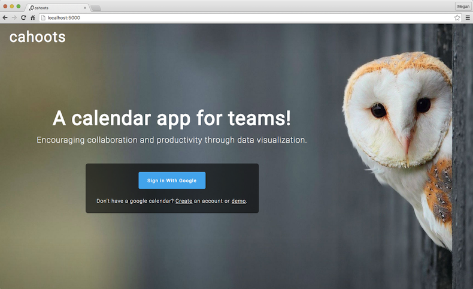
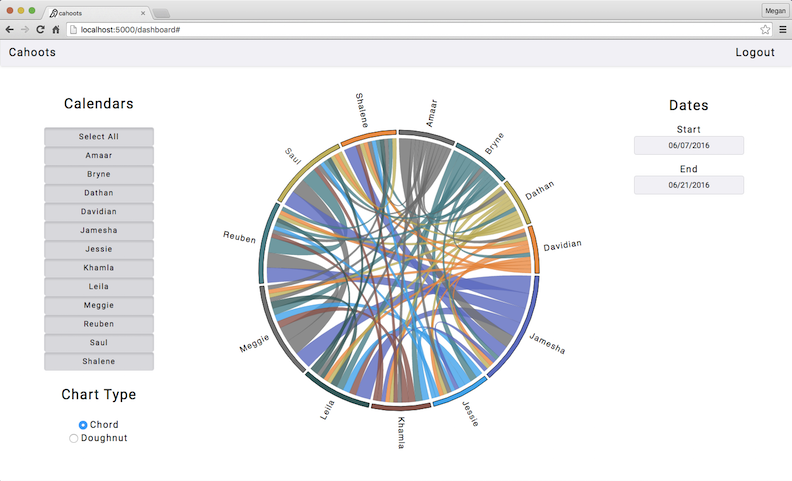
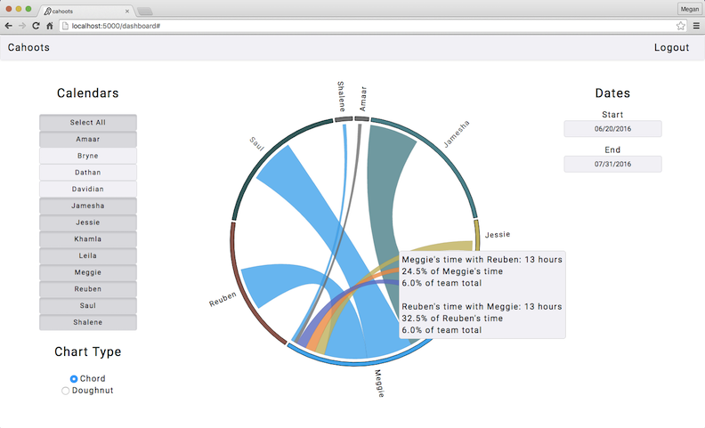
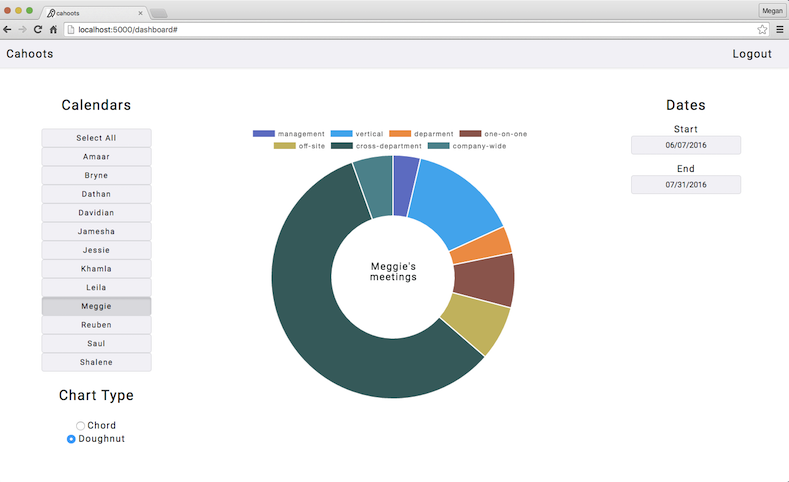

# Cahoots

Learn more about the developer: www.linkedin.com/in/maheskett

Cahoots is a full-stack, data visualization app that provides valuable insights into users calendars. It automatically tags Google Calendar events and generates data on how users and their coworkers spend their time. Cahoots also analyzes the level of collaboration within companies through an interactive D3 diagram. Users can filter by date range and calendars to see how much time any group of people within their company spend working together.

# Table of Contents
* [Tech stack](#technologies)
* [Features](#features)
* [Installation](#install)
* [Version 2.0](#future)

## <a name="technologies"></a>Technologies
- Python, OAuth 2.0, Google Calendar & People APIs, Flask, Jinja2, Datetime
- Javascript, jQuery, AJAX, D3, Chart.js, Underscore.js, Moment.js
- PostgreSQL, SQLAlchemy, HTML5, CSS, Bootstrap

## <a name="features"></a>Features



Users sign in with Google. This is handled through OAuth 2.0, which authenticates the user and authorizes the app to view the user's calendar. For more information, see [Google's OAuth docs](https://developers.google.com/api-client-library/python/guide/aaa_oauth).

####Dashboard

After login, the user is directed to the dashboard page where they can choose which calendars to analyze, along with the chart type and date range. Clicking any of these buttons will send an AJAX request to the server, which then queries the database and returns an object to render the chart.



####Team View

In this D3 chord diagram, the nodes represent each member of the team, and the arcs represent the total amount of time spent working together. Hovering over each arc displays a tooltip with the following info: the total amount of time spent collaborating, the total percentage of each person's time that represents, and the total percentage of the team's time.



####Individual View

In this chart.js doughnut chart, each person's events are categorized into different meeting types. Hovering over each section of the chart displays the total amount of time spent in each meeting category.



## <a name="install"></a>Installation


####Requirements

- Install PostgreSQL (Mac OSX)
- Python 2.6 or greater
- A Google account with Google Calendar enabled


Clone repository
```
$ git clone https://github.com/maheskett/Calendar-Analytics.git
```
Create a virtual environment
```
$ virtualenv env
```
Activate the virtual environment
```
$ source env/bin/activate
```
Install dependencies
```
$ pip install -r requirements.txt
```
Create a project in the [Google Developers Console](https://console.developers.google.com/projectselector/apis/api/calendar/overview) and enable the Google Calendar and Google People APIs.

Create a secrets.sh file
```
$ touch secrets.sh
```
Add your flask app key to the secrets file
```
export FLASK_APP_KEY="flask_app_key_here"
```
Add your OAuth client id and client secret to the secrets file
```
export CLIENT_ID="client_id_here"
export CLIENT_SECRET="client_secret_here"
```
Load your secrets file into your environment
```
$ source secrets.sh
```
Run PostgreSQL and create a database with the name 'cals'
```
$ createdb cals
```
Run the app locally
```
$ python server.py
```
Go to [http://localhost:5000/](http://localhost:5000/) and login


## <a name="future"></a>Version 2.0

Further development includes:
- Additional insights in team view, including:
    - Meeting names
    - Largest and smallest collaborators
- A D3 sunburst diagram in individual view, showing heirarchy of events