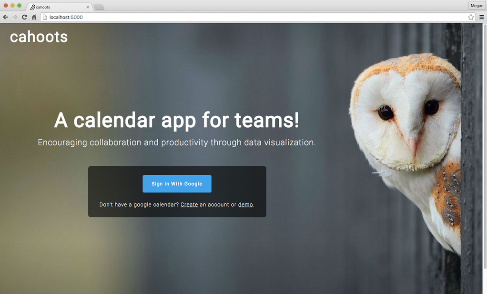
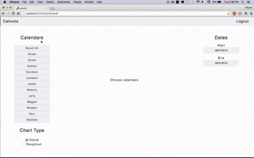

# Cahoots

Learn more about the developer: www.linkedin.com/in/maheskett

Cahoots is a full-stack, data visualization app that provides valuable insights into users calendars. It automatically tags Google Calendar events and generates data on how users and their coworkers spend their time. Cahoots also analyzes the level of collaboration within companies through an interactive D3 diagram. Users can filter by date range and calendars to see how much time any group of people within their company work together.

Technologies:
  - Python, OAuth 2.0, Google Calendar & People APIs, Flask, Jinja2, Datetime
  - Javascript, jQuery, AJAX, D3, Chart.js, Underscore.js, Moment.js
  - PostgreSQL, SQLAlchemy, HTML5, CSS, Bootstrap

